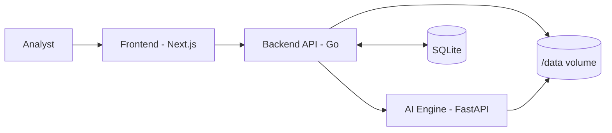

# credit-intel

AI-powered corporate credit appraisal prototype with explainable scoring, evidence traceability, and CAM generation.

## Quick Start (One Command)

```bash
# Clone and start everything
make up
```

This will:
- Build all 3 services (frontend, backend, AI engine)
- Create a SQLite database with 2 pre-loaded demo cases
- Start the stack on `localhost`

| Service       | URL                        |
|---------------|----------------------------|
| **Frontend**  | http://localhost:3000       |
| **Go Backend**| http://localhost:8080       |
| **AI Engine** | http://localhost:8000       |

**Data persists across restarts.** To clear all data: `make clean`

### Other Commands

```bash
make down       # Stop all services
make dev        # Start with live logs (foreground)
make logs       # Follow logs from running services
make clean      # Stop + remove data volume
make help       # Show all available commands
```

### Local Development (No Docker)

```bash
# Terminal 1: AI Engine
cd ai-engine && pip install -r requirements.txt
DATA_ROOT=./data uvicorn app.main:app --reload --port 8000

# Terminal 2: Go Backend
cd backend-go && go run ./cmd/server

# Terminal 3: Frontend
cd frontend && npm install && npm run dev
```

## System Architecture



## Module Responsibilities

| Module | Description |
|--------|-------------|
| `frontend/` | Next.js dark-theme dashboard with evidence viewer, score visualization, severity-coded risk flags |
| `backend-go/` | Orchestration API with SQLite persistence, retry logic, CAM file serving |
| `ai-engine/` | FastAPI service: document parsing, extraction, research agent, scoring engine, CAM DOCX generation |
| `shared/` | OpenAPI contract + JSON schemas |

## Demo Cases

Two realistic cases are pre-loaded on startup:

| Case | Company | Sector | Score | Decision |
|------|---------|--------|-------|----------|
| `demo_healthy_001` | Pranav Textiles Pvt Ltd | Textiles & Apparel | 78.4 | ✅ Approve |
| `demo_risky_002` | Apex Steel & Alloys Ltd | Steel & Metals | 31.2 | ❌ Decline (Hard Override) |

## Data Persistence

- **Database**: SQLite at `$DB_PATH` (default: `/data/credit-intel.db`)
- **Uploads**: Stored in `$DATA_ROOT/uploads/`
- **CAM Documents**: Generated in `$DATA_ROOT/evidence/`
- **Docker Volume**: `credit-data` named volume persists across `docker compose down/up`

### What's Persisted

| Data | Storage |
|------|---------|
| Case metadata | SQLite |
| File metadata | SQLite (JSON) |
| Extracted facts | SQLite (JSON) |
| Risk flags | SQLite (JSON) |
| Score results | SQLite (JSON) |
| Officer note signals | SQLite (JSON) |
| CAM results | SQLite (JSON) |
| Uploaded files | Filesystem (`/data/uploads/`) |
| CAM DOCX files | Filesystem (`/data/evidence/`) |

## AI Pipeline

```
Upload → Extract → Research → Score → CAM
```

1. **Extract**: Parse PDFs, extract financial facts with confidence scores
2. **Research**: Secondary research agent (mock/live) for news, litigation, sector signals
3. **Score**: Weighted scoring (0–100) with hard overrides for critical findings
4. **CAM**: Professional DOCX generation with 9 sections

### Scoring Model

| Weight | Component |
|--------|-----------|
| 25% | Financial Strength |
| 20% | Cash Flow |
| 15% | Governance |
| 15% | Contradiction Severity |
| 15% | Secondary Research |
| 10% | Officer Notes |

**Thresholds**: Approve ≥70 | Review 50–69 | Reject <50

## Environment Variables

See `.env.example` for all options:

| Variable | Default | Description |
|----------|---------|-------------|
| `FRONTEND_PORT` | 3000 | Frontend port |
| `BACKEND_PORT` | 8080 | Backend port |
| `AI_ENGINE_PORT` | 8000 | AI engine port |
| `DATA_ROOT` | /data | Shared data directory |
| `DB_PATH` | /data/credit-intel.db | SQLite database path |
| `AI_ENGINE_BASE_URL` | http://ai-engine:8000 | AI service URL |
| `BACKEND_HTTP_TIMEOUT_SEC` | 30 | Request timeout |
| `SEARCH_PROVIDER` | mock | Search provider (mock/live) |
