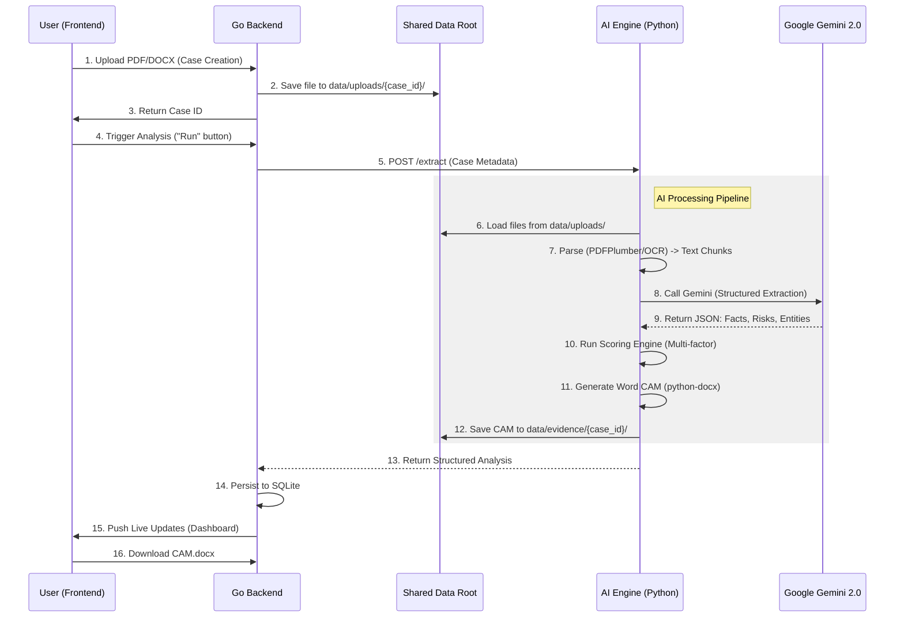

# Credit Intel: Technical Flow & Architecture

This document describes the end-to-end data flow of the **Credit Intel** platform, from document upload to the generation of the Credit Appraisal Memo (CAM).

## 🏗️ System Architecture Overview

The system consists of three main components sharing a unified data volume:
1.  **Frontend (Next.js/React)**: User dashboard for case management and document uploads.
2.  **Backend (Go)**: Orchestrates storage, case persistence (SQLite), and communication with the AI engine.
3.  **AI Engine (Python/FastAPI)**: Heavy-lifting pipeline for OCR, LLM-based extraction, and scoring.

## 🔄 End-to-End Flow (Mermaid)

## 🛠️ Detailed Component Breakdown

### 1. Document Parsing & OCR
- **PDFPlumber**: Direct text extraction for digital PDFs.
- **Tesseract OCR**: Fallback for scanned documents or images.
- **Chunking**: Text is split into logical segments with metadata (page number, chunk ID) to maintain source traceability.

### 2. Gemini AI Extraction Layer
- **Structured Prompts**: We use a specialized "Credit Analyst" prompt to extract key financial metrics (EBITDA, PAT, Revenue) and identify qualitative risks (Auditor remarks, Related Party Transactions).
- **Normalizer**: Converts extracted strings (e.g., "₹14,548 Crore") into normalized numbers while preserving high-confidence source references.

### 3. Credit Scoring Engine
Combines multiple signals into a weighted final score:
- **Financial Strength**: Based on PAT, Revenue, and Debt levels.
- **Governance**: Derived from auditor remarks and promoter behavior.
- **Contradiction Detection**: Flags mismatches between GST filings and bank statements.
- **Officer Notes**: Qualitative insights from field visits integrated via Sentiment Analysis.

### 4. Shared Data Strategy
- **`DATA_ROOT`**: Both Go and Python services point to a project-level `data/` folder.
- **Zero-Latency Handover**: The Go backend writes the file once; the Python engine reads it directly from the same path, avoiding expensive base64 transfers or repeated network hops.
